Day 03 – Part 2: EBS & Linux Disk Management
Activities Completed
Identified attached EBS volumes
Used lsblk and df -h to inspect the existing root disk and newly attached 5 GiB EBS volume.
Identified the new disk as /dev/nvme1n1.
Troubleshot disk permission issue
Initially tried:
fdisk /dev/nvme1n1
Received:
fdisk: cannot open /dev/nvme1n1: Permission denied
Switched to the root user and successfully accessed the disk.
Created a partition
Used:
fdisk /dev/nvme1n1
Created a new Linux partition:
/dev/nvme1n1p1
Verified the partition using:
lsblk
Mounted the EBS volume
Created a mount point:
mkdir /datavolume
Mounted the partition:
mount /dev/nvme1n1p1 /datavolume
Verified the mounted storage and created test files inside /datavolume.
Tested data persistence
Created files:
touch file1 file2 file3 file4 file5 file6
Rebooted the EC2 instance and verified the data remained available.
Worked with /etc/fstab
Checked the disk UUID information using blkid.
Attempted to configure /etc/fstab for persistent mounting.
Encountered an editor permission issue initially and then accessed the file as root.
Used:
mount -a
Verified the disk using lsblk.
Created an EBS Snapshot
Created a snapshot of the 5 GiB EBS volume.
Verified that the snapshot completed successfully with 100% progress in the AWS Console.
Verified AWS infrastructure
Confirmed the VPC, subnet, route tables and Internet Gateway through the VPC Resource Map.
Verified the EC2 instance was Running with 3/3 status checks passed.
Verified the attached EBS volumes from the EC2 Volumes section.
Key Learning
Learned the complete lifecycle of an AWS EBS volume: Create → Attach → Identify → Partition → Mount → Persist → Snapshot → Verify after reboot.

## Hands-On Evidence

### 1. EBS Snapshot List

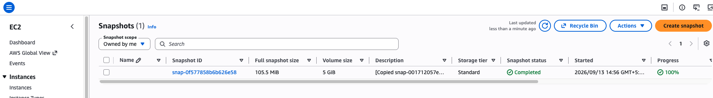

### 2. EC2 Instance Verification

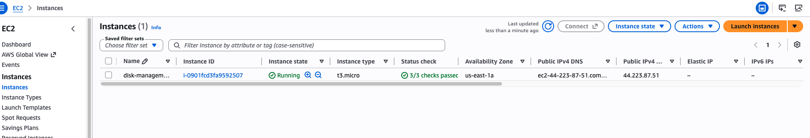

### 3. VPC Resource Map

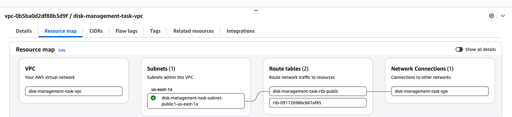

### 4. EBS Volume

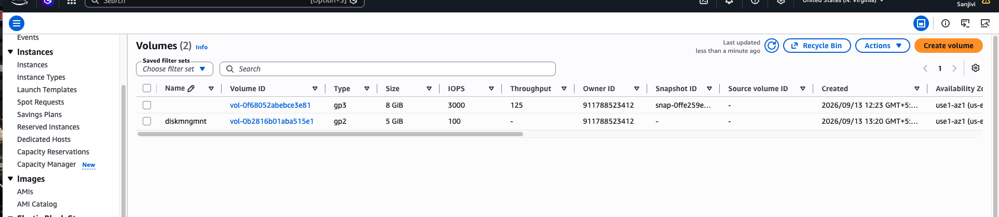

### 5. Snapshot Created

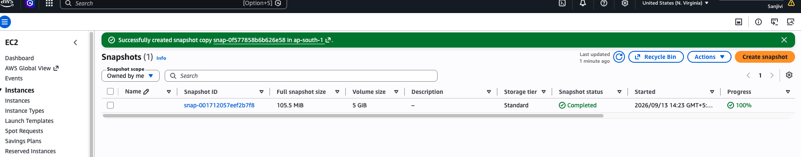

### 6. EC2 Instance Status

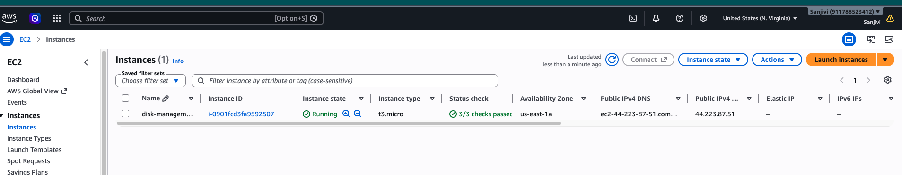

### 7. Partition UUID

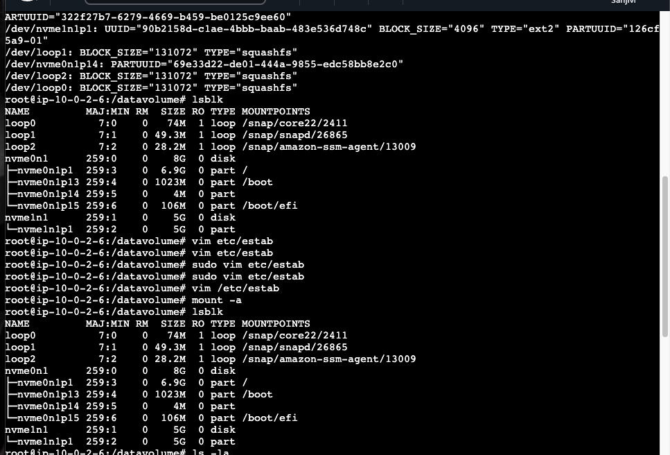

### 8. Filesystem Verification

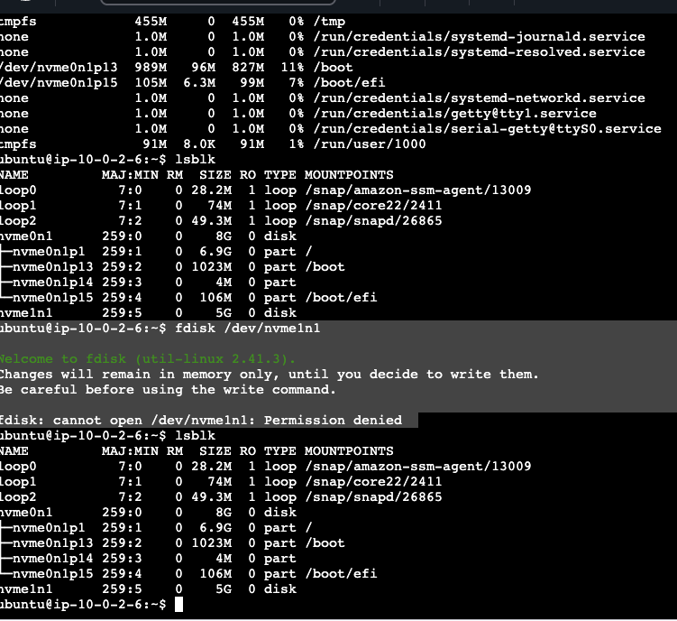

### 9. Disk Partition

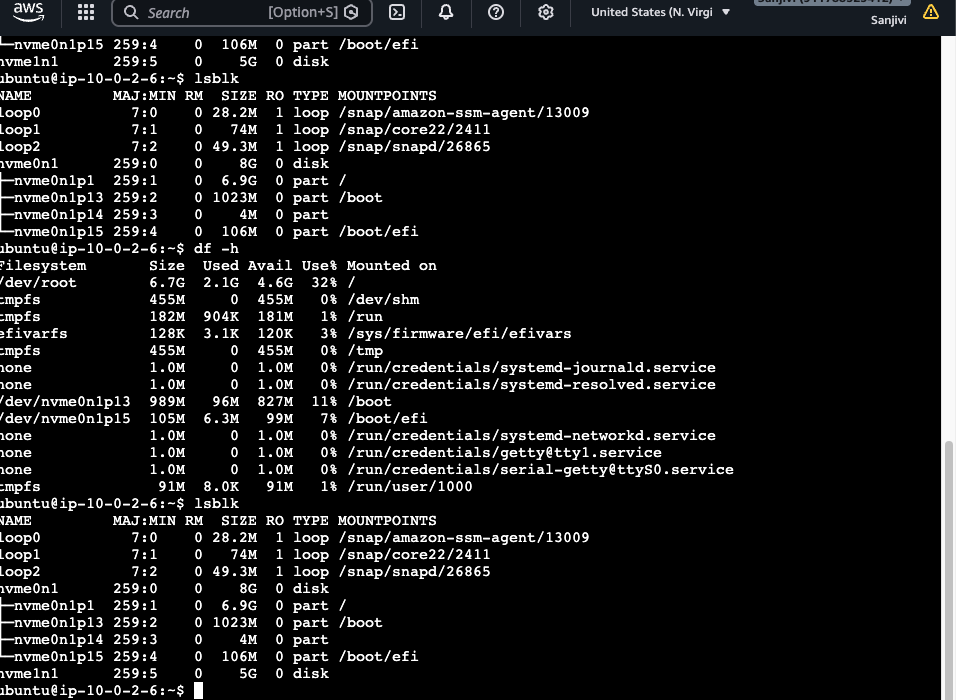

### 10. Persistent Mount

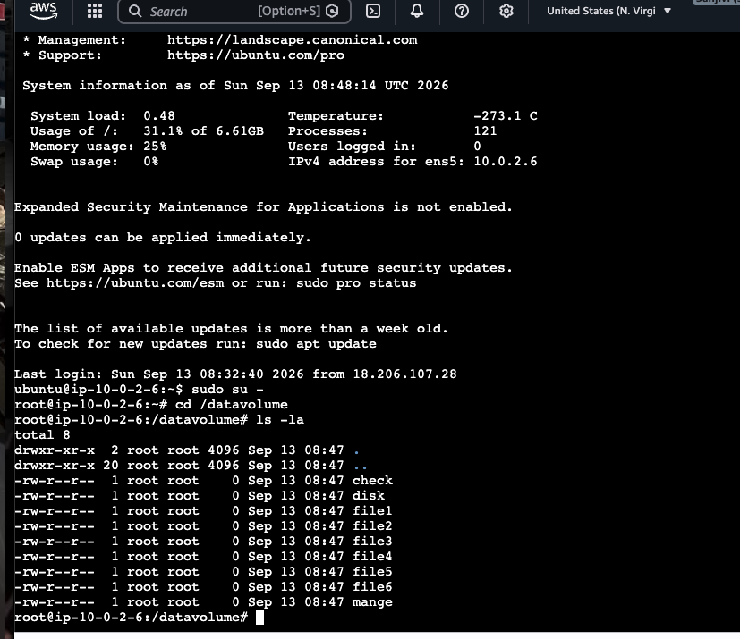

### 11. Final Verification

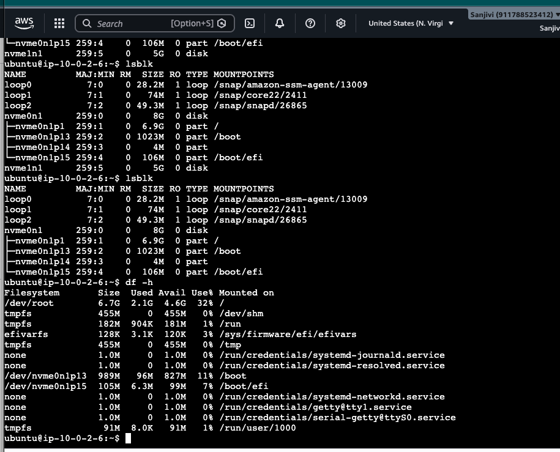

