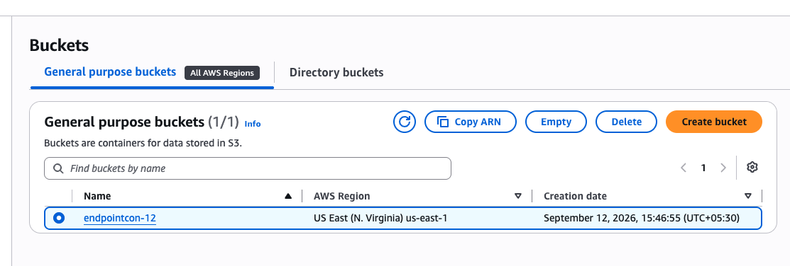
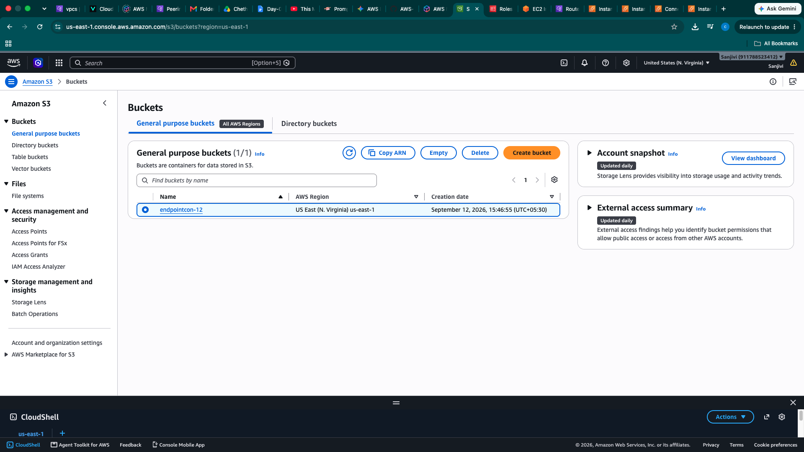
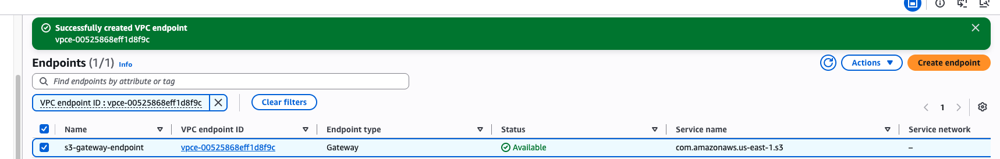
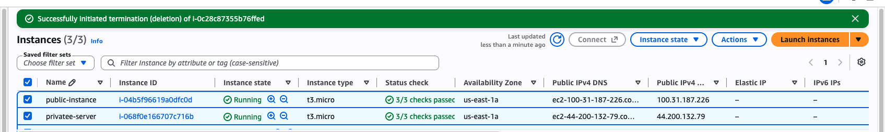
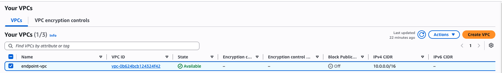
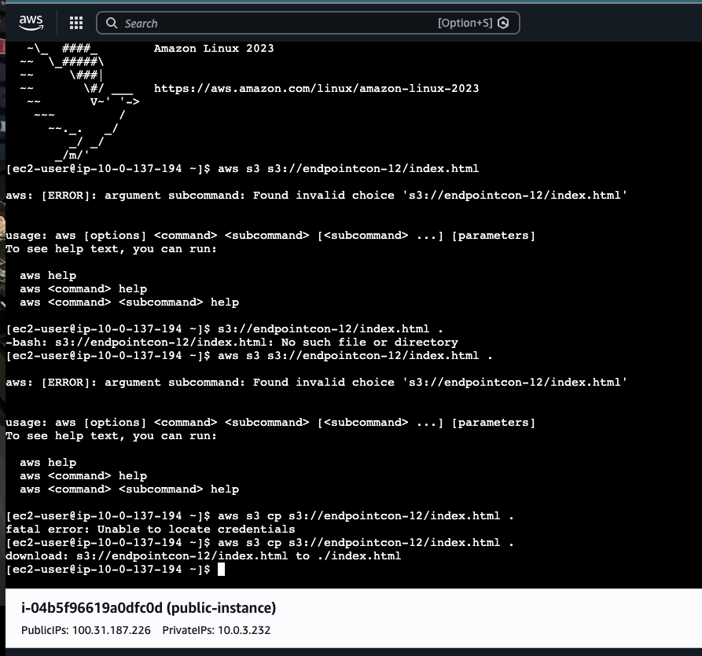

Day 03 – AWS VPC & S3 VPC Endpoint
Activities Completed
Created and configured an AWS VPC with CIDR 10.0.0.0/16.
Created Public and Private Subnets in the VPC.
Configured Internet Gateway and Route Tables for network connectivity.
Launched and verified Public and Private EC2 instances.
Created an S3 Gateway VPC Endpoint to provide private connectivity from the VPC to Amazon S3.
Created an S3 bucket named endpointcon-12.
Tested S3 access from the EC2 instance using AWS CLI.
Used the command:
aws s3 cp s3://endpointcon-12/index.html .
Initially faced an AWS credentials error, troubleshot it, and successfully accessed/downloaded the S3 object afterward.
Verified the VPC Resource Map, including subnets, route tables, Internet Gateway, and S3 Gateway Endpoint.
Created a GitHub repository for maintaining AWS/DevOps theoretical and practical notes.
Key Learning
Understood how an S3 Gateway VPC Endpoint allows EC2 instances inside a VPC to access S3 without requiring traffic to traverse the public internet/NAT Gateway, while routing is controlled through the VPC route table.

## Hands-On Evidence

### 1. S3 Bucket Verification

### 2. VPC Endpoint Setup

### 3. VPC Endpoint Created

### 4. EC2 Instance Verification

### 5. VPC Resource Map

### 6. CLI Connectivity Test

