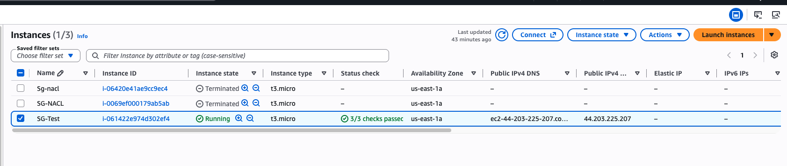
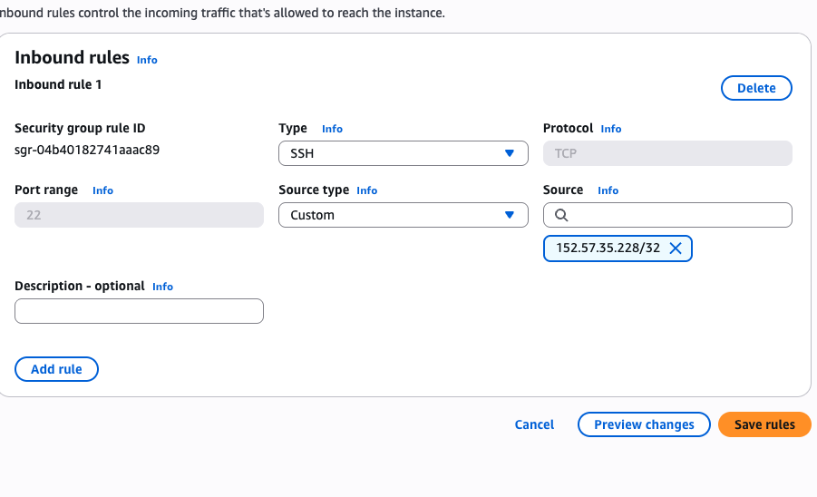
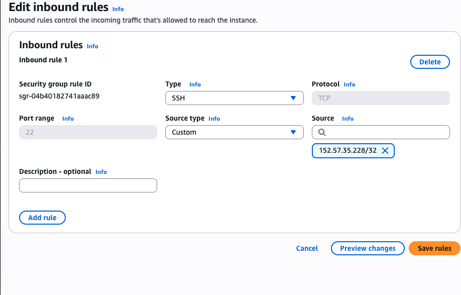
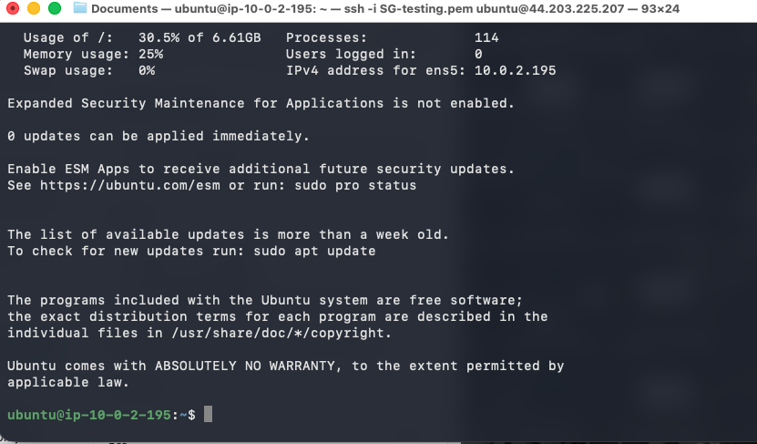
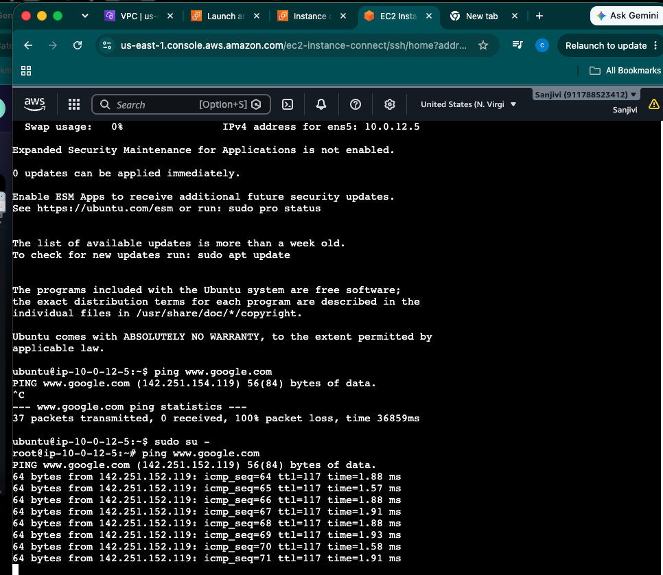
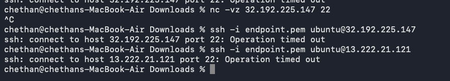

# Day-04 — EC2 Security Group & SSH Troubleshooting

## 1. Objective

The objective of this hands-on was to configure **EC2 Security Group inbound SSH access** and troubleshoot an SSH connectivity failure.

The SSH rule used:

```text
Protocol : TCP
Port     : 22
Source   : My public IPv4 address /32
```

---

## 2. EC2 Security Group Configuration

An inbound Security Group rule was configured for:

```text
TCP
Port 22
Source: Public IPv4 /32
```

This restricts SSH access to the configured public IPv4 address.

Outbound Security Group traffic was also verified.

---

## 3. SSH Connectivity Test

The expected connection path was:

```text
Local Mac
    ↓
Internet
    ↓
Internet Gateway
    ↓
Route Table
    ↓
NACL
    ↓
Security Group
    ↓
EC2 Ubuntu
    ↓
SSH Service
```

The initial SSH connection did not succeed.

Observed error:

```text
ssh: connect to host <EC2-Public-IP> port 22: Operation timed out
```

---

## 4. Troubleshooting

### Step 1 — Use `ssh -vvv`

Verbose SSH troubleshooting was used:

```bash
ssh -vvv <user>@<EC2-Public-IP>
```

This helped establish that the problem was occurring **before SSH authentication**.

---

### Step 2 — Test TCP/22 Independently

The SSH service was tested independently of SSH authentication:

```bash
nc -vz <EC2-Public-IP> 22
```

This separates a network/TCP connectivity problem from a username or `.pem` authentication problem.

---

### Step 3 — Verify Public IP

The current public IPv4 address was checked from the terminal:

```bash
curl -4 ifconfig.me
```

The result showed that the public IP configured as the Security Group source was incorrect.

---

## 5. Root Cause

The Security Group inbound SSH rule contained the **wrong source public IP**.

Therefore the EC2 instance was not accepting TCP/22 traffic from the actual current public IP.

The failure was a **network access problem**, not an SSH username or `.pem` authentication problem.

---

## 6. Fix Applied

The Security Group inbound rule was corrected:

```text
Protocol : TCP
Port     : 22
Source   : Correct Public IPv4 /32
```

After correcting the source IP, SSH connectivity was tested again.

---

## 7. Final Verification

The corrected flow was:

```text
Local Mac
   ↓
Public IP Verification
   ↓
Security Group
TCP 22 → Correct Public IP /32
   ↓
Internet Gateway
   ↓
EC2 Ubuntu
   ↓
SSH Authentication
   ↓
✅ Successfully Logged In
```

The Ubuntu EC2 instance was successfully accessed through SSH.

---

## 8. Linux Disk Commands Practiced

### Check filesystem usage

```bash
df -h
```

Used to check filesystem disk usage and available space.

### Check directory usage

```bash
du -sh
```

Used to check directory/file disk usage.

---

## 9. Commands Used / Practice Commands

```bash
# Verbose SSH troubleshooting
ssh -vvv <user>@<EC2-Public-IP>

# Test TCP port 22 independently
nc -vz <EC2-Public-IP> 22

# Verify current public IPv4
curl -4 ifconfig.me

# Check filesystem disk usage
df -h

# Check directory/file disk usage
du -sh
```

---

## 10. Hands-On Evidence

The following screenshots document the actual Day-04 work:

### 1. EC2 Instance Verification



### 2. Security Group SSH Rule



### 3. Security Group Rule Verification



### 4. EC2 Instance Verification


### 5. Successful SSH Login



### 6. EC2 Instance Connect



### 7. SSH Timeout



---

## 11. Key Learning

The most important troubleshooting lesson from this hands-on was:

```text
SSH Failure
     ↓
Correct EC2 Public IP?
     ↓
Correct Client Public IP?
     ↓
Security Group TCP/22?
     ↓
Route Table?
     ↓
NACL?
     ↓
TCP Connectivity Test
     ↓
ssh -vvv
     ↓
Authentication
     ↓
Success
```

Before changing the `.pem` key or username, first verify the **network path and TCP/22 reachability**.

---

## 12. Hands-On Result

Successfully configured EC2 SSH access using a restricted public IPv4 `/32`, identified an incorrect Security Group source IP as the cause of the timeout, corrected the rule, and successfully connected to the Ubuntu EC2 instance.
